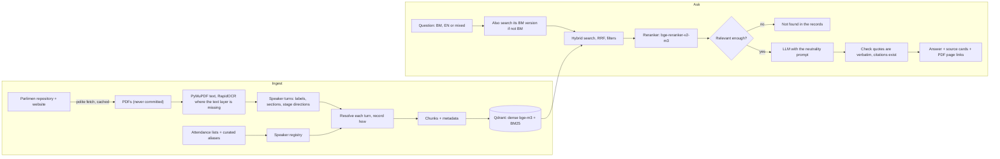

# TanyaDewan

**Cited answers from the Malaysian Dewan Rakyat Hansard, in Bahasa Malaysia, English, or both at once.**

Every answer says who said it and when, and links to the exact page of the official PDF. If the records don't show
it, the system says so instead of guessing. A librarian, not a pundit.

> **Status (30 Sep 2026).** Works end to end on my machine. Not hosted publicly yet: free-tier hosting is the open
> problem (see [Deployment](#deployment)). **Indexed today: 69 of 266 parsed sittings** (9 Oct 2025 to 11 Aug 2026).
> **Retrieval-quality numbers are not published yet.** The golden set is hand-written and still in progress, and I make
> no quality claims without it (see [Evaluation](#evaluation)).

Try questions like:

- `Apa yang MP cakap pasal PTPTN?`
- `Which MPs raised flood mitigation in Kelantan?`
- `Minister cakap apa bila ditanya pasal harga telur?`
- `Siapa betul pasal isu subsidi diesel?` (a bait question: the answer reports each position with citations and declines to rule)

## Why this is an interesting problem

The Hansard is verbatim, political and messy. Misattributing one quote to the wrong MP is the worst failure a system
like this can have, so attribution is treated as the first-class problem, and "not found" counts as a correct answer.

- **Attribution depends on parsing.** Speaker labels change shape, names change honorifics, seats change hands in
  by-elections, and the transcript itself has typos. See [Parsing and attribution](#parsing-and-attribution).
- **Code-switching is real.** Hansard speeches mix BM and English, and so do questions.
- **Some PDFs have no text layer.** Six sittings from Feb to Mar 2023 (plus opening days) are OCR'd.
- **Neutrality is a requirement, not a feature.** See [Neutrality policy](#neutrality-policy).

## How it works



| Layer | What | Where |
|---|---|---|
| Fetch | robots.txt-aware crawler, 4 s between requests, everything cached, descriptive User-Agent, two official sources | `src/tanyadewan/fetch/` |
| Parse | PyMuPDF; RapidOCR fallback; speaker turns, sections, interjections, stage directions, language tag | `src/tanyadewan/parse/` |
| Speakers | Registry built only from attendance lists plus hand-checked aliases; every turn records *how* it was resolved | `src/tanyadewan/speakers/` |
| Index | One chunk per turn (long turns split with overlap); Qdrant with dense `bge-m3` and BM25 sparse vectors | `src/tanyadewan/index/`, `chunk/` |
| Retrieve | Hybrid search fused with RRF, cross-encoder rerank, query translation, filters (date, speaker, party, section), a "not found" gate | `src/tanyadewan/retrieve/` |
| Generate | Pluggable LLM providers with a fallback chain; prompt encodes the neutrality rules; quote and citation verification | `src/tanyadewan/generate/` |
| API | FastAPI with server-sent events; per-IP and daily limits in public mode | `src/tanyadewan/api/` |
| Web | Next.js 16 (App Router), shadcn/ui, Tailwind v4; search-first, filter chips, source cards with official MP portraits | `frontend/` |
| Eval | Harness for recall@k, MRR, nDCG, refusal rate and latency, split by query language | `eval/` |

Stack: Python 3.12 (uv), FastAPI, Qdrant 1.19, bge-m3 (Ollama locally, int8 ONNX on a CPU host), bge-reranker-v2-m3
(ONNX: fp16 on a GPU via DirectML, int8 on CPU), Next.js, Tailwind.

## Parsing and attribution

The full notes, with real examples, are in [docs/parsing-notes.md](docs/parsing-notes.md). The short version:

- **Identity comes only from the attendance lists** printed in each Hansard, plus `aliases.yaml`, which I curate by
  hand and only after checking the source PDF. A speaker label never creates a person. A label that matches no one
  stays unresolved: **unresolved is always preferred to a guess.**
- **Every turn records how it was resolved** (`label_constituency`, `label_name`, `label_fuzzy`, `attendance_role`,
  `chair_named`, `chair_carried`, ...) so any method can be audited by eye with `scripts/spot_check.py`.
- **A seat identifies a person only together with the sitting date.** Seats change hands (by-elections in Kemaman,
  Pulai and Kinabatangan), and a seat held by someone else is never resolved to the wrong person.
- **OCR failures become boundaries, not guesses.** On scanned sittings a few label lines come out as garbage at one
  resolution and read perfectly at another, so low-confidence lines are re-read from crops at several DPIs. A line
  still unreadable becomes a turn with no speaker, and text after it is never merged into the previous speaker.
- **The Hansard has its own typos** ("Ibharim" for Ibrahim, a wrong seat name, one member's name with another's
  seat). The parser records them rather than silently "fixing" them.
- **Drafts are flagged.** Many sittings are printed as unrevised copies ("naskhah belum disemak"). Every record keeps
  a draft flag and a SHA-256, and answers that rest on a draft say so.

**A bug worth telling.** On 30 Sep 2026 I found that the first sitting's attendance list is printed under
"19 DISEMBER 2022 (ISNIN)", and the splitter read that "19" as *entry number 19*. Entries 1 to 19 (the Prime Minister,
both Deputy Prime Ministers, most ministers) were swallowed into one junk "person" holding 390 turns, and three of the
Prime Minister's own turns were credited to a different MP. The fix is in the parser, with a test built from real
entries. Corrected on the same pass: two people printed under two names (merged only after checking the PDFs), and a
label form with an honorific before the role. Across the re-parse, all 150,569 turn IDs and every turn's text were
unchanged; 755 turns changed speaker in 7 kinds of move, each one checked.

Current parse, 30 Sep 2026: **266 sittings, 150,569 turns, 344 speakers, 98.2% of turns resolved to a speaker.**

## Retrieval and generation: decisions

- **Hybrid, not dense-only.** Bill names and acronyms ("PTPTN", "RUU Antibuli") are exactly what pure vectors miss.
  BM25 and dense results are fused with reciprocal rank fusion.
- **A reranker on top**, and its score is also the "not found" signal. Dense cosine alone could not separate real
  from off-topic questions in my probes.
- **Cross-lingual by translation.** An English or mixed question is also searched as its Malay version (one extra
  LLM call), because most of the text is Malay.
- **Filters are filters.** Date range, speaker, section and party narrow the search. Party is a filter and a label,
  never a score, and no feature ranks or rates MPs or parties.
- **The LLM is pluggable and never trusted blindly.** Answers may only use the numbered sources. After generation, a
  verifier checks that quoted spans appear verbatim in a source and that every citation number exists; a quote that
  isn't verbatim is shown with a "not verified" label.
- **Humour lives only in the wrapper** (loading text, empty states, this README), never in answers, quotes or
  anything about a person, party, region or institution.

## Evaluation

The point of the project is to show, with numbers, that these choices were tested. The harness is built; **the golden
set it needs is not finished, so there are no retrieval-quality numbers yet.** I won't publish any until there are.

| Experiment config | What it isolates |
|---|---|
| `1_dense` | dense `bge-m3` only |
| `2_sparse` | BM25 only |
| `3_hybrid` | dense + BM25 with RRF |
| `4_hybrid_rerank` | hybrid + cross-encoder rerank |
| `5_hybrid_rerank_translate` | + translating the question to Malay |

Results table (filled from `eval/results/` once the golden set exists):

| Query language | recall@8 | MRR | nDCG@8 | correct refusal | false refusal | attribution accuracy | latency p50 / p95 |
|---|---|---|---|---|---|---|---|
| Bahasa Malaysia | pending | pending | pending | pending | pending | pending | pending |
| English | pending | pending | pending | pending | pending | pending | pending |
| Mixed | pending | pending | pending | pending | pending | pending | pending |

The golden set (`eval/golden/questions.jsonl`) is **written by hand by me**, including every relevance label. A pool of
60 candidate questions, with no labels or reference answers, is in [eval/golden/candidates.md](eval/golden/candidates.md);
its "unanswerable" ones were picked because their keywords have zero hits in the indexed text. Mix to cover: factual,
speaker, timeline, question-and-reply, cross-lingual, unanswerable, and bait questions that try to get the system to
take a side or make a joke at someone's expense.

### What I have measured so far (operations, not quality)

| What | Result | How |
|---|---|---|
| Indexed text | 69 of 266 sittings, 33,087 chunks | Qdrant count, 30 Sep 2026 |
| Reranker speed | 20 passages in about 0.65 s (fp16, RTX 3050 4 GB) vs about 9 s (int8, CPU) | local timing, `config.yaml` note |
| CPU public profile | 2.4 to 3.4 s per question on a 12-core PC (5 passages, 192 tokens) | local timing, [docs/deploy.md](docs/deploy.md) |
| int8 CPU embedder vs Ollama | cosine about 0.985; same top-1 on 9 of 9 real probe queries | local probe; a small sample, not an eval |
| LLM tokens per question | about 4.1 to 4.2 thousand (3.3 to 3.4K prompt + 0.6 to 0.9K answer) | two real calls with the app's own prompt |
| Tests | 84 passing; `ruff` and `mypy` clean | `uv run pytest` |

## Known limitations

- **Coverage:** 69 of 266 sittings are indexed, so "not found" means "not in the indexed sittings", and the UI says so.
  Only the 15th Parliament (Dec 2022 onward); OCR sittings are noisier.
- **The "not found" threshold is not calibrated.** On my probe questions no threshold separated answerable from
  off-topic ones. It is deliberately low until the golden set's unanswerable questions exist.
- **Party is the member's current party** from their official profile page, applied to every sitting. Party is stored
  per sitting date in principle, but I have no dated source yet. 212 of 344 registry speakers have a party;
  ministers who are not MPs and former members have none and never match a party filter.
- **Free-tier LLMs limit volume.** Groq's free tier for the model in use allows 200,000 tokens a day, about 48
  questions a day at the measured size, with a free fallback model behind it. One answer hit the 900-token cap.
- **The speaker registry still has debris entries** (zero-turn duplicates from odd attendance lines). They hold no
  turns and are hidden from the speaker filter.
- **Labels the parser can't place stay unresolved** (53 label spellings in the last full report) instead of being guessed.
- **Not affiliated with Parlimen Malaysia.** Answers can be wrong; always check the linked PDF page.

## Neutrality policy

This corpus is political, and the system behaves like a librarian.

- Answers report **what was said, by whom, with citations**. Nothing else.
- No judging who is right, no fact-checking MPs against outside sources, no summaries that favour one side.
- When sources show different sides, every side that spoke is represented, each with its own citations.
- No sentiment scoring of parties or MPs. No "most controversial" features.
- Quotes are verbatim. Words are never moved from one speaker to another.
- Bait questions ("who is right?", "which party is worse?") get the positions with citations and a short statement that
  the system only reports what was said.

## Run it locally

Needs [uv](https://docs.astral.sh/uv/), Node 20.9+, an [Ollama](https://ollama.com) install (`ollama pull bge-m3`),
a Qdrant server on port 6333 (the binary, or Docker), and a free [Groq](https://console.groq.com) key in `.env`
(`LLM_API_KEY=...`, see `.env.example`).

```bash
uv sync
uv run python -m tanyadewan.fetch --parlimen 15 && uv run python -m tanyadewan.parse   # about 20 min fetching, polite
uv run python -m tanyadewan.index --limit-docs 10                                        # newest 10 sittings; resumable
uv run python -m tanyadewan.api                                                          # http://127.0.0.1:8766
npm --prefix frontend install && npm --prefix frontend run dev -- --port 3100            # http://localhost:3100
```

Optional: `uv run python -m tanyadewan.speakers.photos` (official MP portraits) and
`uv run python -m tanyadewan.speakers.parties` (current party for the party filter). Indexing every sitting takes
roughly an hour on a laptop GPU. Checks: `uv run pytest && uv run ruff check . && uv run mypy src`.
Tunables are all in `config.yaml`; retrieval experiments are run with `uv run python eval/run_eval.py`.

## Deployment

A public demo is **not hosted yet**. The plan is one Vercel project with two services (the Next.js frontend and the
FastAPI backend on CPU models, routed by the root `vercel.json`) plus a free Qdrant Cloud cluster for the vectors. I
rehearsed the backend service locally from a clean environment (service process peak 1.58 GB against Vercel Hobby's
2 GB limit), but **it has not run on Vercel yet**: Services and large functions are betas that need account
permission. [docs/deploy.md](docs/deploy.md) lists what was checked, what is still unverified, the free-tier limits
that cap traffic (about 48 questions a day on Groq alone), and fallback hosts.

## Source and attribution

Transcripts: **Penyata Rasmi Dewan Rakyat, © Parlimen Malaysia**, from
[repositori.parlimen.gov.my](https://repositori.parlimen.gov.my) and [www.parlimen.gov.my](https://www.parlimen.gov.my).
Non-commercial portfolio use. PDFs are not redistributed: this repository stores no PDFs and no transcript text, and
every answer links back to the official page. MP portraits come from Parlimen's member list, are kept only as small
local thumbnails, and link to the member's official profile.

The crawler obeys robots.txt, waits 4 seconds between requests, caches every page, and never downloads a PDF twice.
